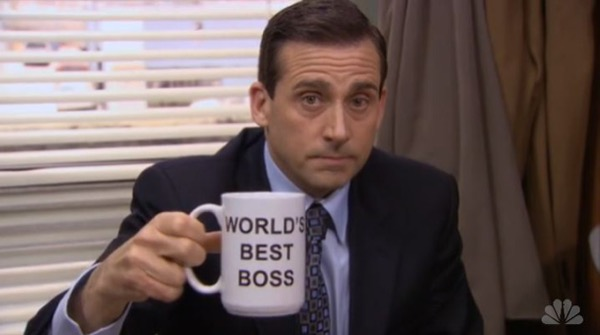
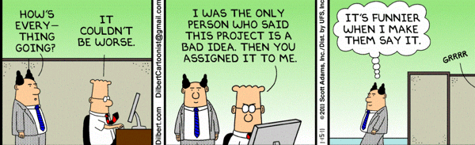
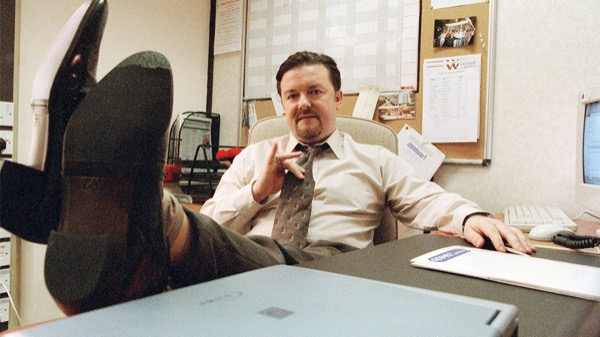
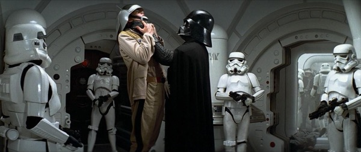

# Assignment: Bad Boss

In this assignment you'll learn and practice database migrations and you'll learn a few bad boss coping skills along the way.




## Preamble

You've just been hired to help to help a robotics factory computerize their operations. A large, bumbling man sits next to you. He glares at you and scoffs, "So you're the hotshot who's gonna bring us into the twentieth century?"

You're about to reply, "You mean twenty-first century?", but decide to keep quiet. This is your first job and this guy is your boss - you don't want to mess it up.

### Your Task:

1.  Fork this repository.


1.  Familiarize yourself with the [Active Record Migrations Guide](http://guides.rubyonrails.org/active_record_migrations.html).




## Your First Migration

Your boss tells you the company needs to keep track of the various parts they have on inventory. For each part, they need to know its:

- name
- manufacturer
- cost

You think to yourself, "Easy, peasy."

### Your Task:

1.  Take a look inside of the `/db` folder of this assignment. Be sure to note what file(s) currently exist.

1.  Create a migration for the `parts` table. Each part will have a name, manufacturer and cost:

    ```
    $ rails generate migration CreateParts name:string manufacturor:string cost:decimal
    ```
1.  Take another look inside `/db` and also look in `/db/migrate`. Note the new file and folder created from the migration generation command.

1.  Look at the `/db/migrate/<time_stamp>_create_parts_table.rb` migration file.

1.  Run your migration:

    ```
    $ rails db:migrate
    ```


1.  Take another look inside `/db`. Note the files that were created from running your migration.

1.  Look at `/db/schema.rb`. This file is autogenerated and updated whenever you run the `db:migrate` command. You should never update this file directly, but rather create a new migration every time you want to change the structure of your database.

1.  Look at your actual database:

    1.  Login to the dbconsole:

        ```
        $ rails dbconsole
        ```

    1.  Look at the tables that exist:

        ```
        sqlite> .tables
        ```

    1.  Look at the structure of the parts table you just created:

        ```
        sqlite> PRAGMA table_info(parts);
        ```

        and

        ```
        sqlite> .schema parts
        ```

1.  Rollback your migration and note what changed in `schema.rb`:

    ```
    $ rails db:rollback
    ```

1.  Run the migration one more time.


## Adding Quantity to Parts

Your boss saunters in smelling like stale french fries and last week's dirty laundry. He growls, "Didn't I already tell you we need to keep track of the quantity of each part?  What's the point of a parts database without knowing how many parts we have?"

Your task:

1. Create a migration that adds quantity. This time, instead of generating all the details of the migration on the command line, we'll just generate the file without providing details, and then edit the file manually. It's not uncommon to generate migrations this way.

    ```
    $ rails generate migration AddQuantityToParts
    ```

1.  Edit the file just created and insert the details of the migration:

    ```ruby
    class AddQuantityToParts < ActiveRecord::Migration[5.0]
      def change
        change_table :parts do |t|
          t.integer :quantity
        end
      end
    end
    ```

1.  Run the migration.

1.  Look at `schema.rb`.

1.  Use the `rails dbconsole` to look at your table.

1.  Rollback your migration to ensure rollback is working properly.

1.  Run your migration again.

1.  Look at the content of the `schema_migrations` table in the `dbconsole`. Rails uses this specially generated table to keep track of what migrations it has already run:

    ```
    SELECT * FROM schema_migrations;
    ```
1. Now run the command `rails db:migrate:status` for an easier way to see which migrations have already been run. "up" means a migration has been applied, "down" means it hasn't.


## Creepy Party Invitation

Your boss is having a big party and he's decided to use the company's high-powered computer to keep track of all his guests. He's also asked you to keep track of some rather personal information. Your not sure if this is ethically a good thing to do, but you decide to stay mum in hopes for a promotion.

### Your Task

1.  Create a migration to create a `party_guests` table that keeps track of the guest details:

    - first name
    - last name
    - dietary restrictions
    - salary
    - number of kids
    - vulnerabilities
    - illnesses
    - medication
    - voting preferences

1.  Go through the cycle of:

    1.  Running the migration
    2.  Noting the changes in the `schema.rb`
    3.  Noting the changes to the database using `dbconsole`
    4.  Ensuring you can properly rollback and re-run the migration.


## New Locations Migration

Your boss comes in hungover from his big party last night. He's in a particularly foul mood. The company's expanding locations, and he just found out he didn't get the promotion to Regional Location Director he was hoping for.

### Your Task

1.  Create a migration to create a locations table. Your boss never gave you any more details about each location, so it's up to you to decide what fields should be added.

1. Go through the cycle of checking in on `schema.rb`, `dbconsole`, rolling back and re-running the migration.


## Obscuring the Party Guests Table

The company's IT department has noticed that there's an unusual amount of computation required by the database. Your boss comes in more disheveled than usual. "You have to hide that party list!"
"What's the magic word?" you ask. "Do it!" he yells.
You shrug. It's not 'please' but it'll do.

### Your Task

1.  Create a migration that changes the table name of `party_guests` to `widgets`.

2.  You know the drill: `schema`, `dbconsole`, rollback, re-migrate.


## No More Quantity Needed for Parts

The next day your boss storms in demanding to know why you're tracking the quantity for each part? That's another department's responsibility! You sigh and agree to fix it.

It's a particularly slow day at the office, and your friends have been raving about these `def up` and `def down` methods available to you in your migration files.

### Your Task

1. Remove the `quantity` from the parts table.  Instead of using the regular `def change` method in your migration, use `def up` and `def down`.

1. Check in on schema, dbconsole and test rolling back and re-migrating. For future migrations, ensure you do this 'cycle' so your aware of what's happening to your database and that your migrations run 'clean' (i.e. rolling back and re-migrating works fine).

## Change the Locations Table

Your boss has a scheme to mess up the locations table with the hope the Regional Location Director will be sacked.

### Your Task

1.  Make it so your `locations` table only track two things: `city` and `weather`.



## Delete the Widgets Table

Your boss runs in, wild-eyed and paranoid. "We're in trouble now," he says, "Our department's going to take the blame for all the important location table information that's gone missing. They're going to want to look through our database." He tells you to create a new migration to restore the locations table back to its previous structure. He also tells you to immediately delete the old party invitations table which is currently named widgets.

### Your Task

1.  Create a new migration that restores the `location` table to how it used to be structured.

1.  Delete the `widgets` table using a migration.



## The Director

Oh no! The company found out about the purposely corrupted locations table. Then they looked into the old migration files and noticed the party guests table. The Department's Director calls you and your boss into her office. She wants an explanation.

"It's not my fault," your boss stammers, "I'm the best boss ever. Everybody says so. Blame this hotshot over here."

The Director shakes her head. "You're unprofessional, you're unethical and now - you're fired." She looks at you and smiles. "Congratulations. A new position has just opened up. How would you like a promotion?"


## The End

Commit and submit your code.

## Stretch

1. Read up about the various `rails` commands that affect the database. Use `rails -T` on the command line to see a list of them.

1. Change the structure of your database by directly altering `schema.rb`. Be sure to change field names, remove some fields, and add fields that didn't exist before.

1. Drop and setup your database using `rails db:drop` and `rails db:setup`.

1. Now try to `rollback` all the migrations to the beginning. What happens? Try to figure out how to fix this issue and get the proper database structure working again.
